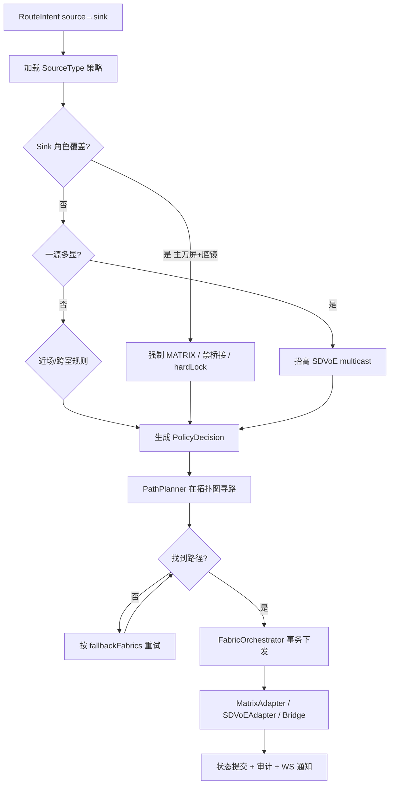

# 策略决策流（简图）



## 混合通路示例

```text
腔镜(SDI) ──► Matrix IN ──► Matrix OUT ──► 主吊臂          （主路径，低延迟）
                │
                └──► Bridge Decoder/Encoder ──► SDVoE ──► 示教屏/远端
```

示教分发允许 1 次桥接；主刀屏策略 `max_bridge_hops: 0`。
